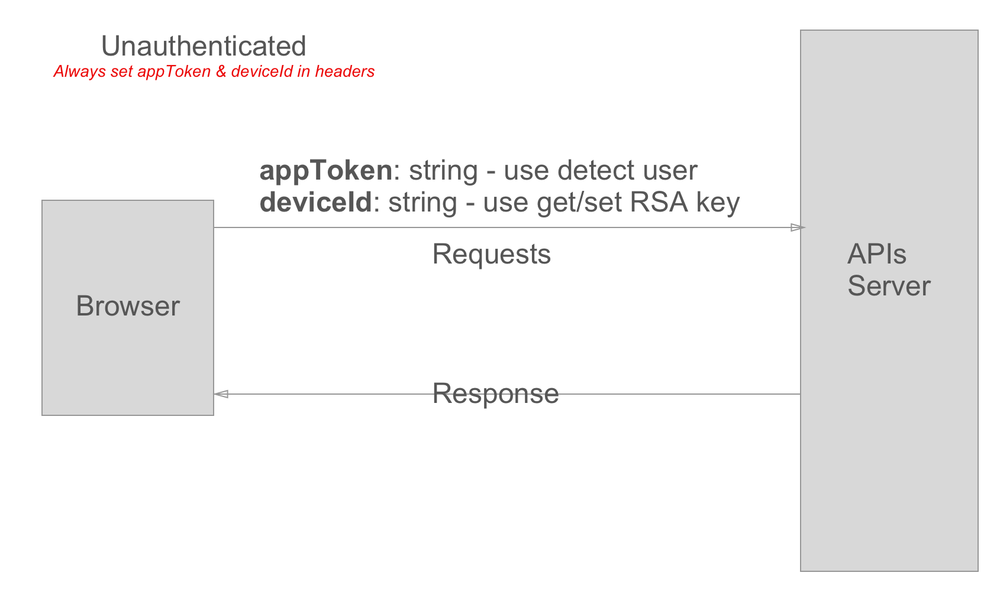
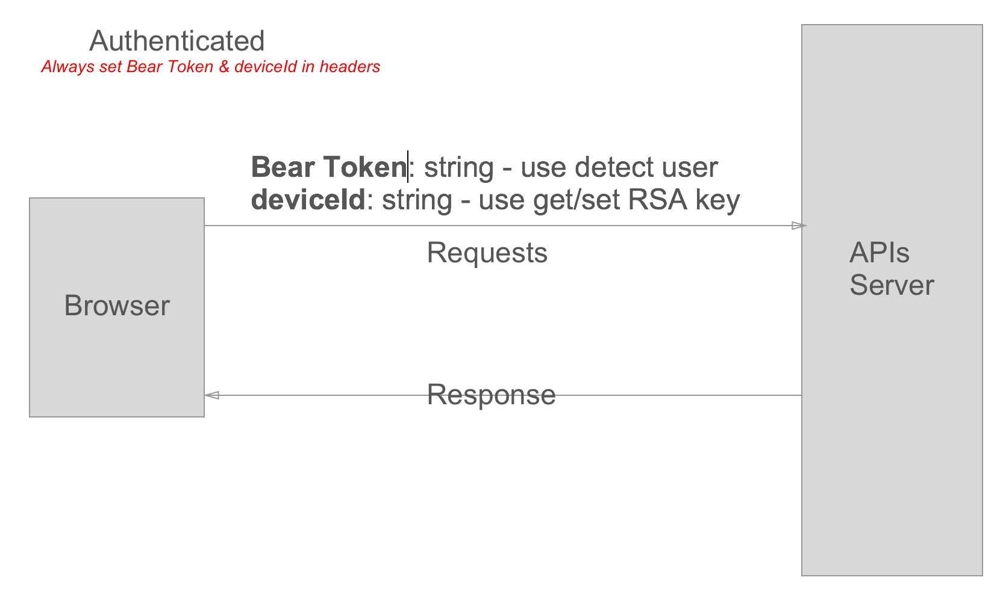

# Hosiana Web Version 2.0

## Setup environment & Version in local
Node JS version >= v8.9.x but `recommend use version v10.1.x`\
Typescript version >= v2.8.x

## Flowchart Call APIs
We have 2 type APIs for call are `Unauthenticated` and `Authenticated`.\
**Unauthenticated** then for all APIs without login, example Register, Get RSA Keys, etc. And use `appToken` in headers to determined users of system, `deviceId` to get/set RSA keys.
 

**Authenticated** then for all APIs logged. And use `Bear Token` in headers to determined users of system, `deviceId` to get/set RSA keys.

**Notes:** Always use `macAddr = keys.getUUID();` for get device id and use it is key to get RSA keys for web browser.\
More info please go to [Wiki Pages](https://bitbucket.org/admin_tnhh/hosiana-ver2.0/wiki/browse/) for get details 

This project was generated with [Angular CLI](https://github.com/angular/angular-cli) version 6.0.8.

## Development server

Run `ng serve` for a dev server. Navigate to `http://localhost:4200/`. The app will automatically reload if you change any of the source files.

## Code scaffolding

Run `ng generate component component-name` to generate a new component. You can also use `ng generate directive|pipe|service|class|guard|interface|enum|module`.

## Build

Run `ng build` to build the project. The build artifacts will be stored in the `dist/` directory. Use the `--prod` flag for a production build.

## Running unit tests

Run `ng test` to execute the unit tests via [Karma](https://karma-runner.github.io).

## Running end-to-end tests

Run `ng e2e` to execute the end-to-end tests via [Protractor](http://www.protractortest.org/).

## Further help

To get more help on the Angular CLI use `ng help` or go check out the [Angular CLI README](https://github.com/angular/angular-cli/blob/master/README.md).

## Build & run angular universal (server side rendering)
npm run build:ssr && npm run serve:ssr
